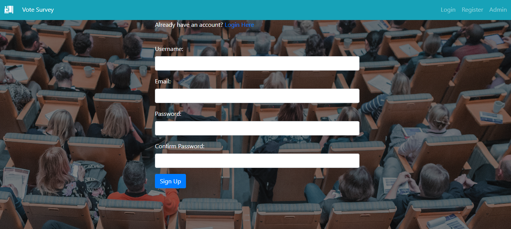
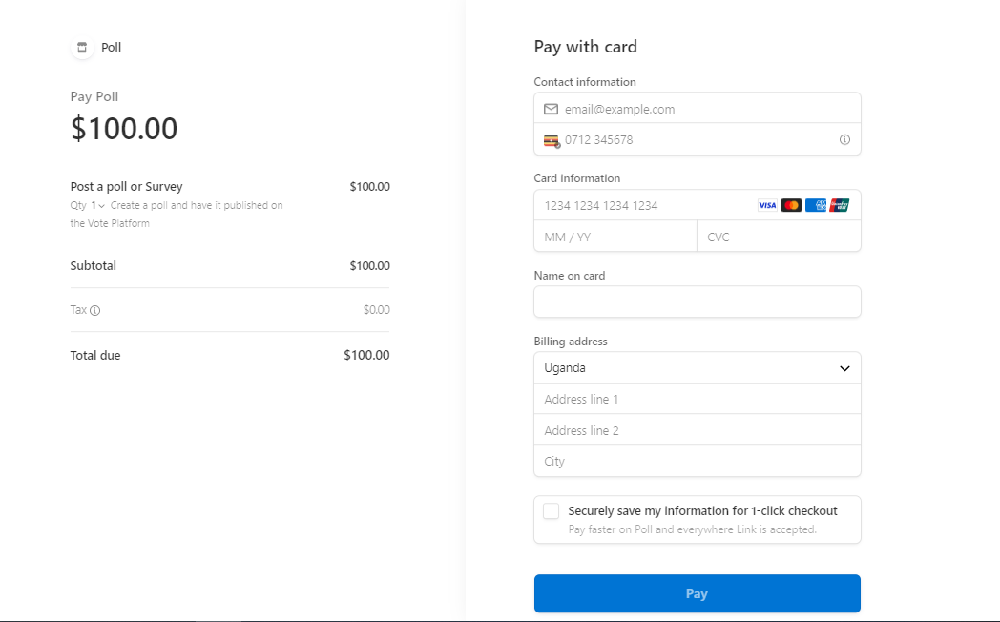

# VOTE

**WHO:** The business model that the Vote ecommerce platform uses is a B2B (Business to Business). This means that other businesses or organizations are our customers.

**WHAT(Deliverable):** Vote ecommerce website is a platform that offers services. The site offers survey or poll services because we believe that feedback matters. Businesses come with their queries and then we connect them to users on the platform who are in turn paid for their time to take the surveys. Therefore, vote enables clients to create and the respondents to take surveys through paid opinion polls.

**GOAL OF VOTE**

The goal is to create a poll to inform marketing strategies and get instant feedback or predict voter behaviour.
The other goal is to be fast, be easy and to create a platform that works on any device.

**PURPOSE OF VOTE**

To bridge the gap and to connect the surveyors and the respondents.

**WHY FOR BUSINESSES**

If you're a marketer or entrepreneur, you can poll customers to get straight answers about how to improve your product or service. You can also discover which competitor, if any, has a better solution. Using a poll creator is fast, cheap to manage, and gets you data quickly. Hand out the same poll several times throughout the year to see how crowd sentiment changes.

**HOW: Vote has two types of payments**

1.	From the clients, in this case the businesses who have brought the surveys in other words the surveyors.

2.	The Users taking the surveys (surveyees). The surveyees or respondents in this case are expected to first take the polls, answer or fulfil their end of the deal. After which they will receive payment on successful submission of their opinions.

**NOTE:** For the surveys, vote presents surveys in the form of multiple-choice questions and in that way reduces the amount of unwanted data from the polls or surveys. The choice to use multiple choice questions is also advantageous to the respondents in the sense that it saves time on filling, is convenient and easy to understand.

### VOTE MARKETING STRATEGIES

* Sharing a direct link to the online survey.

* Partnering with relevant influencers on social media like Facebook who can help spread the word.

* Offering a prize for participants to encourage more involvement.

* The use of newsletters through email marketing with the help of Mailchimp.

### USERS:

The users of the Vote platform include the platform administrator, the business which requires a service from vote (the surveyor) and the people taking the surveys (or the participants or respondents)

## USER STORIES

**THE PLATFORM**

The vote platform will allow users to register for an account either as a business or as a respondent.

The platform will allow users to login and out, be able to reset their passwords if they have forgotten it.

The platform will allow the logged in users to have access to personalized user profiles and possibly store their default payments and log their survey activities.

The platform will allow users to view their surveys, the taken surveys or the created surveys (that is the survey history).

**AS A PLATFORM ADMINISTRATOR USER**

As a platform administrator, I want to have access to the list of people who have signed up, list of polls taken and the votes.

As a platform administrator, I want to be able to add a survey. To add a new survey form with multiple choice questions.

As a platform administrator, I want to be able to edit or update a survey service. To change survey service prices, if need be, the survey descriptions and other survey service criteria.

As a platform administrator, I want to be able to delete a survey. To remove old and completed survey polls that are no longer of use.

**AS A RESPONDENT USER**

As a respondent, I want to be able to view the site details so that I can sign up as a participant, be able to view the surveys and select a survey to fill.

As a respondent, I want to view the pricing list that is the price or service description so that I can select and determine how many surveys to fill.

As a respondent, I want to view the total number of answered polls so that I can know how much I have earned from taking the surveys.

**AS A BUSINESS USER**

As a business or client, I want to be able to view the site details so that I can sign up as a client surveyor with Vote.

As a business, I want to view the pricing list (price, service description) so that I can select the appropriate survey package.

As a business, I want to view the total number of answered polls, be able to see the answers so that I can determine voter behaviour, get instant feedback to help create an informed marketing strategy.

**USER STORIES CATEGORIES SUMMARY**

1.	Viewing and Navigation
2.	Registration and User accounts
3.	Creating and Taking survey polls
4.	Payments
5.	Administration and platform management.

------

## FEATURES
------
1. **The Navigation Bar**

* The navigation bar is responsive and is included on all the site pages. It provides  links to the home page, the survey votes, the login, register and admin pages.

* This section allows users to go from page to page across all devices without having to use the back button to return to the previous page.

* The nav bar appears different for users who are not logged into the system and also has a different view for users who are registered.

* navbar after login

2. **The landing page**

* The first page that a user lands on when they access the vote platform. The page comprises an image, the services, the website details, the pricing,  the newsletter subscription  button, a social media handle.

3. **The register page**

The page captures information such user name and passwords(authentication credentials) for new users on the website.

4. **The login page**

The page allows users who are already registered on the website to sign into the platform.

* The admin login page

5. **Respond page**

The respond page enables users who registered to take surveys on the platform. When the users click on the take survey button, it redirects them to the vote survey portal. the portal has information on the available surveys, and allows the users to search for specific surveys and also to organize the lists in either ascending or descending order  by date, votes or name.

6. **The publish page**

The publish page enables business users to publish surveys on the platform. When the users click on the publish survey button, it redirects them to the vote survey portal. the portal has information on the available surveys, and allows the users to search for specific surveys and also to organize the lists in either ascending or descending order  by date, votes or name. The portal also enables business users to add or update surveys. **Note** Both respondents and business users are redirected to the vote survey portal, howvever, only business users have permissions to create, update or delete surveys.

7. **payment for poll**

This enables business users to pay for the surveys by capturing payment details.

8. **payment to respondents**

This enables respondents to get pay for the surveys taken.

**Features left to Implement**

* Exapnd access levels to include three access levels instead of the initial two being surveyors and respondents. The three would be surveyors, respondents and the platform admin who is independent of the surveyors or respondents.

* Implement live payment method since this is a prototype and the current payment method is in test mode. There it cannot process live payments.

---------

## DATABASE SCHEMA

Within the vote 4 me database, a user or surveyor creates a poll, this poll is comprised of choices upon which the respondent votes.

The database schema is comprised of the following custom models;

**1.User**

* The User model is used to capture vote user details. These include details for surveyors and respondents. This model's unique identifier is the user ID.

**2.Poll**

* This model is used capture poll data. This includes poll status, poll ID being the primary key, date of publishment and the owner of the poll which is the surveyor. The poll model is related to all the models in the vote database schema. This relationship is enforced by the presence of the users's ID as a foreign key.

* Furthermore, the poll ID also appears as the foreign key in the vote and choice models.

**3.Vote**

* This model is used to capture vote details which include vote ID as a primary key, user ID, choice ID, and poll ID as foreign keys.

* These foreign keys represent the vote owner or respondent, the choice being the answer of the respondent and poll ID being the poll under which the choices are categorized.

* This illustrates a one to many relationship between the vote, choice, poll and user models.

**4.Choice**

* The choice model is used to capture choice ID as a primary key, poll ID as a foreign key for which poll the choice belongs to and also the choice text.

* The choice model has a one to many relationship to the different models in the database.

------------

## TESTING AND VALIDATION

* Ecommerce testing was performed where various ecommerce elements such as design, specifications, functionalities, pages and features are tested to check their sanity and ensure they are not harming the performance of the site in any manner possible.

**Testing plan for the vote platform**

*	Users can log in
*	Users can register as a business/surveyor or respondent
*	The main/landing page of the vote platform loads
*	The payment page loads
*	A single service page loads
*	A business user can add, update a survey
*	A respondent user can view and fill a survey
*	A business user can view the total polls, and answers
*	A respondent can view the total polls filled
*	Both business and respondents can reach the logout page
*	A registered user can logout

### Testing

**1. Automated Django Unit tests**

Django unit testing was used to;

* -Ensure a relationship exists, between the user and poll models. This is relationship was
tested by checking if a poll can be created by a non exitent user.
* -Test if the index, login and signup or register urls can be accessed or served by the application.
* -Test if the server is handling non existent url calls to our application.

* The results after running through "python manage.py test"

**2.The functionality of the site**

**3.Responsiveness**

* The vote 4 me app is responsive to different media devices. Media queries are set for different device views with a maximum width of 768 pixels and 600 pixels or below.

* I have tested the responsiveness of the vote 4 me app and therefore happy to report that through code inspection, the vote app responds well to different device views.

**4.Bugs and fixes**

**Bug 1:** During the login phase, there was a bug that returned false message for users created that are not in the system. This bug was fixed by displaying the information in a flash message.

**Bug 2:** There was an error when capturing user account payment credentials. There was no need to capture user payment credentials due to the fact that we are using stripe payments.

### Validation

•	Frontend validation was used to ensure that form data being submitted to our views are not empty or null.

•	Server-side validation was used to ensure that the right data was being posted before capturing it to the database.

**Validator testing**

**1.HTML**

* No error was found when passing through the offcicial W3C validator.

**2.CSS**

* No errors were found when passing through the official jigsaw validator.

**3.Python**

* No errors were found in the final code base when passing through the pycodestyle validator.

**4.Accessibility**

* The accessibility score for desktop applications using lighthouse is 93.

---------

## DEPLOYMENT

**Version Control**

•	The site was created using the Visual Studio Code editor and pushed to GitHub to the remote repository vote.

The following git commands were used throughout development to push code to the remote repo:

•	git add - This command was used to add the file(s) to the staging area before they are committed.

•	git commit -m "commit message" - This command was used to commit changes to the local repository queue ready for the final step.

•	git push - This command was used to push all committed code to the remote repository on GitHub.

**Heroku deployment**

The following steps were followed to deploy this project to Heroku:

•	Go to Heroku and click "New" to create a new app(“vote4me”).

•	Choose an app name and region (“EU Stockholm-eu-north-1”), click "Create app"

•	Go to "Settings" and navigate to Config Vars. Add the following config variables:
PORT : 8000
disable_connectstatic:1

•	Navigate to Buildpacks and add buildpacks for Python and NodeJS (in that order).

•	Navigate to "Deploy". Set the deployment method to GitHub and enter repository name (“vote”) and connect.

•	Scroll down to Manual Deploy, select "main" branch and click "Deploy Branch".

•	The app will now be deployed to Heroku

--------

## CREDITS

•	Boutique ado project videos on how to deploy the application to Heroku, use AWS, Mailchimp and stripe.

•	W3C Schools for functions used in this python command line terminal application https://www.w3schools.com/python/python_functions.asp

•	You tube tutorials on how to import library in python https://www.youtube.com/watch?v=h0oRPIlnJYQ

•	Survey and poll data about why the use of polls for entrepreneurs or businesses obtained from https://www.typeform.com/examples/polls/

•	 Free photos used for the landing page from pixabay obtained from https://pixabay.com/images/search/free%20images/

•	Ecommerce testing description obtained from https://vwo.com/blog/ecommerce-testing/

•	Stripe payments data obtained from https://dashboard.stripe.com/payments

•	AWS bucket creation pdf document obtained from https://codeinstitute.s3.amazonaws.com/fullstack/AWS%20changes%20sheet.pdf

•	Solutions to questions and bugs using stack overflow https://stackoverflow.com/

•	Fixed some pep8 validation errors using stack overflow https://stackoverflow.com/questions/492387/indentationerror-unindent-does-not-match-any-outer-indentation-level

